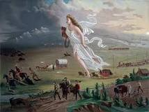

# College Classes Notes
## Bio 10
### Evolution and Darwin's Theory
Evolution, the process by which species undergo changes over time, has been a cornerstone of biological science since the 19th century. Charles Darwin's theory of evolution by natural selection, first articulated in his work On the Origin of Species (1859), provides the most comprehensive explanation of how evolutionary processes occur. Darwin's theory was heavily influenced by earlier thinkers and scientists, such as geologist Charles Lyell and Thomas Malthus. Darwin applied the gradualist view of uniformitarianism to biological species, and his journey on the HMS Beagle exposed him to diverse species and ecosystems, particularly in the Galápagos Islands.

## Hist 17

The Philosophy of Manifest Destiny 
The Philosophy of Manifest Destiny concept origins in the nation's founding traditions have been rooted in the long-standing tradition of territorial expansion. It usually implies a divine motivation to go get more land or well known as territorial expansion. It was coined from a magazine editor known as John O’Sullivan. This was found in a book he had written called “Magazine and Democratic Review” and it was in 1845. This idea was easy to understand, which was that it was the Americans' divine destiny and ordained to go grab and claim territories. Not only that but to lead democratic ideas throughout not only the countries but the whole continent. Even though O’Sullivan had taken/coined the phrase it was before him. In the 1800s and so on people had already been writing about how it was Americas’ greatest destiny to rule over the continent.

