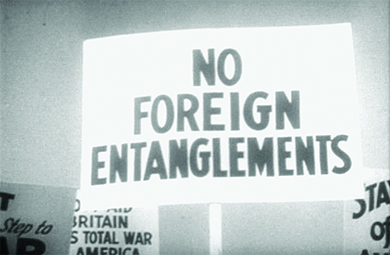

# FROM NEUTRALITY TO ENGAGEMENT

President Franklin Roosevelt faced challenges from Nazi aggression in Europe and Japanese aggression in Asia, but Congress's commitment to nonintervention was difficult to overcome. Senator Gerald P. Nye of North Dakota encouraged this policy, claiming the US had been tricked into participating in World War I by industrialists and bankers. Roosevelt refused assistance to those fleeing Nazi Germany and did little to aid Jews, withdrewing the American ambassador to Germany in 1938. To prevent further war, Congress passed a series of Neutrality Acts in the 1930s, including banning the sale of armaments, loaning money to belligerent countries, and forbidding the transportation of weapons or passengers to belligerent nations on American ships. After the war began between Japan and China, Roosevelt sought ways to help the Chinese without violating U.S. law

