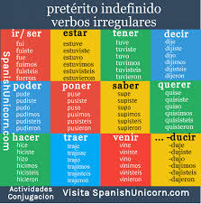

# Spanish 2

## El Pretérito

###  Forms Irruglares 

*Date: 10/3/24*

**Author: Anthoney Trejo**

|  |  |  |  |   |
| :---: | :---: | :---: | :---: | :---:|   
| uv | Tener to Tuve | Estar to Estuve | Andar to Anduve
| u | Poder to Pude  | Poner to Puse  | Saber to Supe
| i | Hacer to Hice | Querer to Quise | Venir to Vine
| j | Decir to Dije | Traer to Traje |

| yo | tú | él/ella/usted | nosotros | vosotros | ellos/ellas/ustedes
| :---: | :---: | :---: | :---: | :---:| :---: |  
| e | iste | o | imos | isteis | ieron |
 